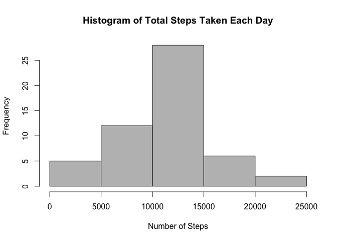
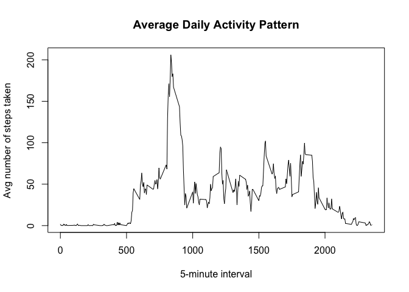
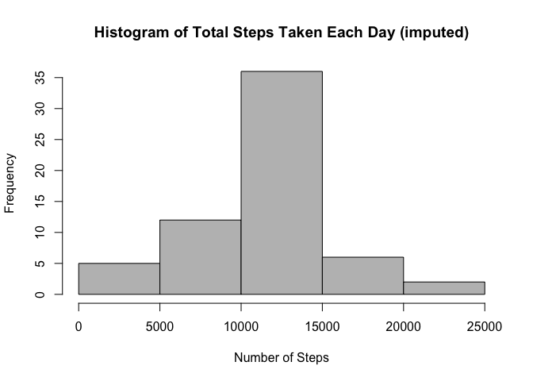
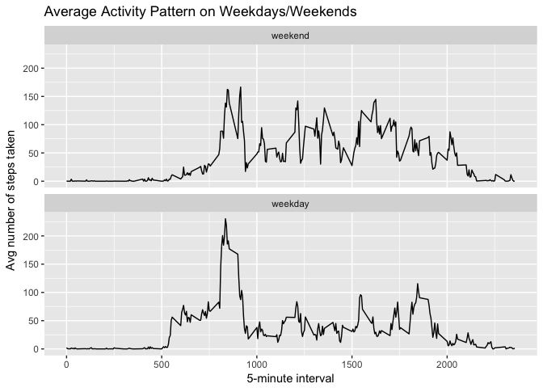

# Reproducible Research: Peer Assessment 1


## Loading and preprocessing the data

```r
# Unzip the file
if(!file.exists('activity.csv')) {
    unzip("./RepData_PeerAssessment1/activity.zip", exdir = "./RepData_PeerAssessment1")
}

## Load the data
activity <- read.csv("activity.csv", header=TRUE, na.strings="NA")
```


## What is mean total number of steps taken per day?

```r
# Calculate the total number of steps taken per day
stepsPerDay <- aggregate(steps ~ date, data=activity, sum)

# Make a histogram of the total number of steps taken each day
hist(stepsPerDay$steps, xlab = "Number of Steps", main = "Histogram of Total Steps Taken Each Day", col="grey")
```

<!-- -->

```r
# Calculate the mean and median total number of steps taken per day
stepsMean <- mean(stepsPerDay$steps)
stepsMedian <- median(stepsPerDay$steps)
```

**Mean:** 1.0766189\times 10^{4}  
**Median:** 10765


## What is the average daily activity pattern?

#### Make time-series plot of the 5-minute interval (x-axis) & the avg number of steps taken, averaged across all days (y-axis).

```r
# Get the average number of steps per time interval
intervalAvg <- aggregate(steps ~ interval, data=activity, mean)

plot(intervalAvg$interval, intervalAvg$steps, type = "l", xlab="5-minute interval", ylab="Avg number of steps taken", main="Average Daily Activity Pattern")
```

<!-- -->

```r
# Which 5-minute interval, on average across all the days in the dataset, contains the maximum number of steps?
maxInterval <- intervalAvg[which.max(intervalAvg$steps),]
```
**Interval 835 contains the maximum number of steps (206.17 steps).**


## Imputing missing values

```r
# Calculate and report the total number of missing values in the dataset (i.e. the total number of rows with NAs)
NA_sum <- sum(is.na(activity$steps))
```
**There are 2304 missing values in the dataset.**

I decided to fill in the NAs using the mean for that 5-minute interval:

```r
activityImputed <- activity # new dataset to be rewritten

for (i in 1:nrow(activityImputed)) {
    if (is.na(activityImputed$steps[i])) {
        activityImputed$steps[i] <- intervalAvg$steps[activityImputed$interval[i] == intervalAvg$interval]
    }
}
```

#### Make a histogram of the total number of steps taken each day.

```r
## Make a histogram of the total number of steps taken each day.
stepsPerDayImputed <- aggregate(steps ~ date, data=activityImputed, sum)

hist(stepsPerDayImputed$steps, xlab = "Number of Steps", main = "Histogram of Total Steps Taken Each Day (imputed)", col="grey")
```

<!-- -->


#### Calculate the mean and median total number of steps taken per day. Do these values differ from the estimates from the first part of the assignment?  What is the impact of imputing missing data on the estimates of the total daily number of steps?

```r
stepsMean_new <- mean(stepsPerDayImputed$steps)
stepsMedian_new <- median(stepsPerDayImputed$steps)
```

**Mean:** 1.0766189\times 10^{4}  
**Median:** 1.0766189\times 10^{4}

**The mean has NOT changed due to the imputed values. The median has changed minimally by 1.1886792**


## Are there differences in activity patterns between weekdays and weekends?

#### Create a new factor variable in the dataset with two levels – “weekday” and “weekend” indicating whether a given date is a weekday or weekend day.

```r
library(ggplot2)
```

```
## Warning: package 'ggplot2' was built under R version 3.3.2
```

```r
# convert to weekdays
activityImputed$dateType <- weekdays(as.Date(activityImputed$date))

# convert to factor
activityImputed$dateType <- factor(activityImputed$dateType)

# set the 'weekday' & 'weekend' levels
levels(activityImputed$dateType) <- list("weekend"=c("Saturday","Sunday"), "weekday"=c("Monday","Tuesday","Wednesday","Thursday","Friday"))
```

#### Make a panel plot containing a time series plot of the 5-minute interval (x-axis) and the average number of steps taken, averaged across all weekday days or weekend days (y-axis).

```r
intervalAvgImputed <- aggregate(steps ~ interval + dateType, data=activityImputed, mean)

qplot(interval, steps, data=intervalAvgImputed, geom="line", xlab="5-minute interval", ylab="Avg number of steps taken", main="Average Activity Pattern on Weekdays/Weekends") + facet_wrap(~dateType, nrow=2)
```

<!-- -->

